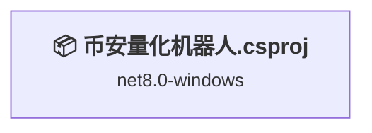
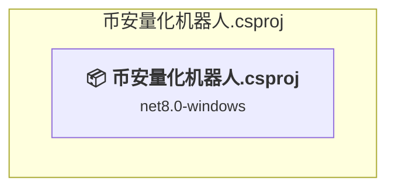

# Projects and dependencies analysis

This document provides a comprehensive overview of the projects and their dependencies in the context of upgrading to .NET 9.0.

## Table of Contents

- [Projects Relationship Graph](#projects-relationship-graph)
- [Project Details](#project-details)

  - [币安量化机器人.csproj](#币安量化机器人csproj)
- [Aggregate NuGet packages details](#aggregate-nuget-packages-details)

## Projects Relationship Graph

Legend:
📦 SDK-style project
⚙️ Classic project

## Project Details

### 币安量化机器人.csproj

#### Project Info

- **Current Target Framework:** net8.0-windows✅
- **SDK-style**: True
- **Project Kind:** Wpf
- **Dependencies**: 0
- **Dependants**: 0
- **Number of Files**: 208
- **Lines of Code**: 36081

#### Dependency Graph

Legend:
📦 SDK-style project
⚙️ Classic project

#### Project Package References

| Package | Type | Current Version | Suggested Version | Description |
| :--- | :---: | :---: | :---: | :--- |
| Binance.Net | Explicit | 8.3.0 |  | ✅Compatible |
| CommunityToolkit.Mvvm | Explicit | 8.4.0 |  | ✅Compatible |
| Microsoft.Data.Sqlite | Explicit | 8.0.4 |  | ✅Compatible |
| Microsoft.Extensions.Configuration.Json | Explicit | 9.0.10 |  | ✅Compatible |
| ScottPlot | Explicit | 5.0.56 |  | ✅Compatible |
| ScottPlot.WPF | Explicit | 5.0.56 |  | ✅Compatible |
| Serilog | Explicit | 4.2.0 |  | ✅Compatible |
| Serilog.Enrichers.Environment | Explicit | 3.0.1 |  | ✅Compatible |
| Serilog.Enrichers.Thread | Explicit | 4.0.0 |  | ✅Compatible |
| Serilog.Sinks.Console | Explicit | 6.1.1 |  | ✅Compatible |
| Serilog.Sinks.Debug | Explicit | 3.0.0 |  | ✅Compatible |
| Serilog.Sinks.File | Explicit | 7.0.0 |  | ✅Compatible |
| System.Text.Json | Explicit | 9.0.10 |  | ✅Compatible |

## Aggregate NuGet packages details

| Package | Current Version | Suggested Version | Projects | Description |
| :--- | :---: | :---: | :--- | :--- |
| Binance.Net | 8.3.0 |  | [币安量化机器人.csproj](#币安量化机器人csproj) | ✅Compatible |
| CommunityToolkit.Mvvm | 8.4.0 |  | [币安量化机器人.csproj](#币安量化机器人csproj) | ✅Compatible |
| Microsoft.Data.Sqlite | 8.0.4 |  | [币安量化机器人.csproj](#币安量化机器人csproj) | ✅Compatible |
| Microsoft.Extensions.Configuration.Json | 9.0.10 |  | [币安量化机器人.csproj](#币安量化机器人csproj) | ✅Compatible |
| ScottPlot | 5.0.56 |  | [币安量化机器人.csproj](#币安量化机器人csproj) | ✅Compatible |
| ScottPlot.WPF | 5.0.56 |  | [币安量化机器人.csproj](#币安量化机器人csproj) | ✅Compatible |
| Serilog | 4.2.0 |  | [币安量化机器人.csproj](#币安量化机器人csproj) | ✅Compatible |
| Serilog.Enrichers.Environment | 3.0.1 |  | [币安量化机器人.csproj](#币安量化机器人csproj) | ✅Compatible |
| Serilog.Enrichers.Thread | 4.0.0 |  | [币安量化机器人.csproj](#币安量化机器人csproj) | ✅Compatible |
| Serilog.Sinks.Console | 6.1.1 |  | [币安量化机器人.csproj](#币安量化机器人csproj) | ✅Compatible |
| Serilog.Sinks.Debug | 3.0.0 |  | [币安量化机器人.csproj](#币安量化机器人csproj) | ✅Compatible |
| Serilog.Sinks.File | 7.0.0 |  | [币安量化机器人.csproj](#币安量化机器人csproj) | ✅Compatible |
| System.Text.Json | 9.0.10 |  | [币安量化机器人.csproj](#币安量化机器人csproj) | ✅Compatible |

