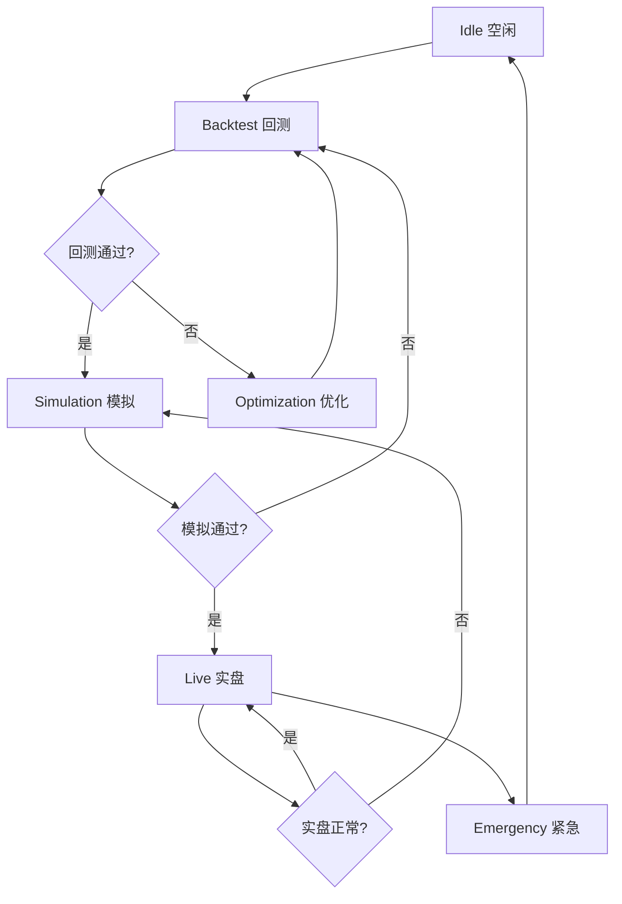

# 中央AI协调器 - 系统架构文档

## 📋 概述

中央AI协调器（`AICentralCoordinator`）是整个量化交易系统的"智能大脑"，负责全局统管、自主决策和模块协同。它实现了从策略研发→回测验证→模拟交易→实盘交易的全流程自动化管理。

## 🎯 核心目标

**让AI成为系统的智能中枢，自主调度所有模块协同工作，实现真正的智能化量化投资管理。**

## 🏗 系统架构

### 架构层级

```
┌─────────────────────────────────────────────────────────┐
│         第1层：AI中央协调器 (决策层)                      │
│  ┌──────────┐ ┌──────────┐ ┌──────────┐ ┌──────────┐   │
│  │状态管理器 │ │决策引擎  │ │工作流编排│ │学习模块  │   │
│  └──────────┘ └──────────┘ └──────────┘ └──────────┘   │
│              ↕ (指令下发 + 状态监控)  ↕                  │
│                      事件总线                            │
└─────────────────────────────────────────────────────────┘
                           ↓
┌─────────────────────────────────────────────────────────┐
│         第2层：功能模块集群 (执行层)                      │
│  ┌──────────┐ ┌──────────┐ ┌──────────┐ ┌──────────┐   │
│  │策略研发  │ │回测验证  │ │模拟交易  │ │实盘交易  │   │
│  ├──────────┤ ├──────────┤ ├──────────┤ ├──────────┤   │
│  │风险控制  │ │绩效分析  │ │账户管理  │ │仓位管理  │   │
│  └──────────┘ └──────────┘ └──────────┘ └──────────┘   │
│              ↕ (数据反馈 + 执行结果)  ↕                  │
└─────────────────────────────────────────────────────────┘
                           ↓
┌─────────────────────────────────────────────────────────┐
│         第3层：数据基础设施 (支撑层)                      │
│  ┌──────────┐ ┌──────────┐ ┌──────────┐ ┌──────────┐   │
│  │行情数据流│ │账户数据流│ │交易数据流│ │日志系统  │   │
│  └──────────┘ └──────────┘ └──────────┘ └──────────┘   │
└─────────────────────────────────────────────────────────┘
```

## 🔄 工作流程

### 主控制循环

```csharp
while (系统运行)
{
    // 1. 收集全系统状态
    SystemState state = CollectSystemState();
    
    // 2. AI决策分析
    AIDecision decision = DecisionEngine.Analyze(state);
    
    // 3. 执行工作流编排
    WorkflowOrchestrator.Execute(decision);
    
    // 4. 学习优化
    LearningModule.UpdateKnowledge(state, decision);
    
    // 5. 等待下一个周期
    await Task.Delay(GetInterval());
}
```

### 阶段切换流程



## 📦 核心组件

### 1. StateManager (状态管理器)

**职责**：
- 管理当前工作流阶段
- 维护系统状态快照
- 状态转换验证
- 状态持久化

**关键方法**：
```csharp
// 设置工作流阶段
void SetStage(WorkflowStage stage);

// 更新系统状态
void UpdateState(SystemState state);

// 判断是否可以切换到目标阶段
bool CanTransitionTo(WorkflowStage targetStage);

// 获取状态摘要
string GetSummary();
```

**状态转换规则**：
```
✅ 允许的转换：
- Idle → 任何阶段
- Backtest → Simulation | Optimization
- Optimization → Backtest
- Simulation → Live | Backtest
- Live → Simulation
- Emergency → Idle

❌ 不允许的转换：
- Live → Backtest (需先降级到Simulation)
- Optimization → Live (需先通过Backtest和Simulation)
```

### 2. DecisionEngine (决策引擎)

**职责**：
- 分析系统状态
- 基于规则做出决策
- 评估各阶段结果
- 决定工作流切换
- 基于历史学习优化决策

**决策规则示例**：
```csharp
// 规则1: 高波动保守规则
if (MarketCondition.IsHighVolatility)
    return DecisionAction.ReduceRisk;

// 规则2: 风险警报规则
if (RiskMetrics.HasRiskAlert)
    return DecisionAction.Stop;

// 规则3: 策略良好规则
if (Strategy.IsPerformingWell && Risk.IsSafe)
    return DecisionAction.Continue;

// 规则4: 资源不足规则
if (!SystemResources.IsHealthy)
    return DecisionAction.Pause;

// 规则5: 账户升级规则
if (Account.IsProfitable && WinRate > 0.65 && Stage == Simulation)
    return DecisionAction.Upgrade;
```

**回测评估标准**：
```
通过条件：
✅ 夏普比率 >= 1.5
✅ 最大回撤 <= 15%
✅ 胜率 >= 55%
✅ 总收益 >= 20%

失败处理：
❌ 如果总收益 > 0 → 进入参数优化
❌ 如果总收益 <= 0 → 返回策略研发
```

**模拟交易评估标准**：
```
通过条件：
✅ 盈利 >= 15%
✅ 最大回撤 <= 10%
✅ 胜率 >= 60%
✅ 运行时长 >= 7天

失败处理：
❌ 如果亏损 > 5% 或回撤 > 20% → 返回回测
❌ 否则 → 继续模拟
```

**实盘监控标准**：
```
异常调整：
⚠️ 单日亏损 > 500 USDT
⚠️ 最大回撤 > 12%
⚠️ 连续亏损 > 3次

紧急暂停：
🚨 单日亏损 > 1000 USDT
🚨 最大回撤 > 20%
🚨 连续亏损 > 5次
```

### 3. WorkflowOrchestrator (工作流编排器)

**职责**：
- 执行AI决策
- 管理阶段切换
- 协调各模块执行
- 处理异常和回滚

**动作执行映射**：
```csharp
DecisionAction.Continue    → 继续当前流程
DecisionAction.Pause       → 发布暂停请求事件
DecisionAction.Stop        → 发布紧急停止事件
DecisionAction.Upgrade     → 发布账户升级请求事件
DecisionAction.Downgrade   → 发布账户降级请求事件
DecisionAction.Optimize    → 发布优化请求事件
DecisionAction.ReduceRisk  → 发布降低风险请求事件
DecisionAction.Hold        → 观望
```

**阶段切换示例**：
```csharp
// 1. 离开当前阶段
await ExitStageAsync(currentStage);

// 2. 进入新阶段
await EnterStageAsync(targetStage);

// 3. 更新状态
StateManager.SetStage(targetStage);

// 4. 发布阶段切换事件
await EventBus.PublishAsync(new StageTransitionEvent
{
    FromStage = currentStage,
    ToStage = targetStage,
    Timestamp = DateTime.UtcNow
});
```

### 4. LearningModule (学习模块)

**职责**：
- 记录历史决策和结果
- 分析决策效果
- 优化未来决策
- 识别模式和趋势
- 持续改进系统性能

**学习流程**：
```
1. 记录决策
   ├─ 系统状态快照
   ├─ AI决策内容
   └─ 决策时间戳

2. 更新结果
   ├─ 决策是否成功
   ├─ 盈亏百分比
   └─ 持续时长

3. 查找相似场景
   ├─ 工作流阶段相同
   ├─ 市场状况相似
   └─ 风险等级相似

4. 分析历史表现
   ├─ 各动作的成功率
   ├─ 平均盈利
   └─ 最大盈亏

5. 优化决策
   ├─ 历史表现不佳 → 降低信心度
   ├─ 历史表现良好 → 提升信心度
   └─ 信心度过低 → 建议观望
```

**相似度计算**：
```csharp
// 市场相似度
var marketSimilarity = 
    (1.0 - |hist.Volatility - curr.Volatility|) * 0.33 +
    (1.0 - |hist.Trend - curr.Trend| / 2.0) * 0.33 +
    (1.0 - |hist.Liquidity - curr.Liquidity|) * 0.33;

// 需要 marketSimilarity > 0.7 且风险等级相似
```

### 5. EventBus (事件总线)

**职责**：
- 模块间异步通信
- 事件发布和订阅
- 事件历史记录
- 解耦模块依赖

**事件类型**：
```
🔸 工作流事件：
- WorkflowExecutedEvent (工作流执行)
- StageTransitionEvent (阶段切换)

🔸 控制事件：
- PauseRequestEvent (暂停请求)
- EmergencyStopEvent (紧急停止)
- AccountUpgradeRequestEvent (账户升级请求)
- AccountDowngradeRequestEvent (账户降级请求)
- OptimizationRequestEvent (优化请求)
- ReduceRiskRequestEvent (降低风险请求)

🔸 阶段事件：
- StartBacktestEvent (启动回测)
- StartOptimizationEvent (启动优化)
- StartSimulationEvent (启动模拟交易)
- StartLiveTradeEvent (启动实盘交易)
- StopSimulationEvent (停止模拟交易)
- StopLiveTradeEvent (停止实盘交易)

🔸 业务事件：
- BacktestCompletedEvent (回测完成)
- SimulationUpdateEvent (模拟交易更新)
- LiveTradeEvent (实盘交易)
- RiskAlertEvent (风险警报)
```

**使用示例**：
```csharp
// 订阅事件
EventBus.Subscribe<BacktestCompletedEvent>(async evt =>
{
    LogService.Info("回测完成: {Strategy}", evt.StrategyName);
    
    var evaluation = DecisionEngine.EvaluateBacktestResult(evt);
    
    if (evaluation.ShouldProceedToSimulation)
    {
        await WorkflowOrchestrator.TransitionToStageAsync(WorkflowStage.Simulation);
    }
});

// 发布事件
await EventBus.PublishAsync(new BacktestCompletedEvent
{
    StrategyName = "MA_Cross",
    TotalReturn = 0.32,
    SharpeRatio = 1.8,
    MaxDrawdown = 0.12,
    WinRate = 0.62,
    TotalTrades = 150,
    StartDate = DateTime.Parse("2024-01-01"),
    EndDate = DateTime.Parse("2024-12-31"),
    Timestamp = DateTime.UtcNow
});
```

### 6. ResourceManager (资源管理器)

**职责**：
- 监控系统资源使用
- 基于优先级分配资源
- 防止资源耗尽
- 优化资源利用率

**优先级定义**：
```
0: Emergency  (紧急状态)     - 最高优先级
1: Live       (实盘交易)
2: Simulation (模拟交易)
3: Backtest   (回测)
4: Optimization (优化)
5: Idle       (空闲)         - 最低优先级
```

**资源分配策略**：
```csharp
// 高优先级任务：实盘交易执行和风控
if (Priority <= 1)
    AlwaysAllocate();

// 中优先级任务：实时策略优化
if (Priority == 2 && Resources.IsHealthy)
    Allocate();

// 低优先级任务：历史数据回测分析
if (Priority >= 3 && Resources.CpuUsage < 0.6 && Resources.MemoryUsage < 0.6)
    Allocate();
else
    Skip(); // 高负载时跳过
```

**并发控制**：
```csharp
// 最多同时执行5个任务
private readonly SemaphoreSlim _executionSemaphore = new(5, 5);

// 请求执行令牌
using var token = await ResourceManager.AcquireExecutionTokenAsync(stage);
// ...执行任务...
// 令牌自动释放
```

## 🎮 使用指南

### 基本使用

```csharp
// 1. 获取中央AI协调器
var coordinator = ServiceLocator.GetAICentralCoordinator();

// 2. 启动主控制循环
await coordinator.StartAsync();

// 3. 查询状态
var currentState = coordinator.CurrentState;
var currentStage = coordinator.CurrentStage;

Console.WriteLine($"当前阶段: {currentStage.GetDisplayName()}");
Console.WriteLine($"市场波动率: {currentState.MarketCondition.Volatility:P0}");
Console.WriteLine($"账户净值: {currentState.AccountStatus.NetValue:N2} USDT");

// 4. 停止协调器
await coordinator.StopAsync();
```

### 高级使用 - 事件监听

```csharp
var coordinator = ServiceLocator.GetAICentralCoordinator();

// 订阅阶段切换事件
coordinator._eventBus.Subscribe<StageTransitionEvent>(async evt =>
{
    Console.WriteLine($"阶段切换: {evt.FromStage.GetIcon()} → {evt.ToStage.GetIcon()}");
    
    // 自定义处理逻辑
    if (evt.ToStage == WorkflowStage.Live)
    {
        // 进入实盘交易，发送通知
        await NotificationService.SendAsync("✅ 系统已进入实盘交易模式");
    }
});

// 订阅风险警报事件
coordinator._eventBus.Subscribe<RiskAlertEvent>(async evt =>
{
    Console.WriteLine($"🚨 风险警报: {evt.Message}");
    
    if (evt.Severity == RiskSeverity.Critical)
    {
        // 严重风险，手动干预
        await coordinator.StopAsync();
        await NotificationService.SendAsync($"🛑 系统已紧急停止: {evt.Message}");
    }
});

await coordinator.StartAsync();
```

### 高级使用 - 学习统计

```csharp
var coordinator = ServiceLocator.GetAICentralCoordinator();
var learningModule = coordinator._learningModule;

// 获取学习统计信息
var stats = learningModule.GetStatistics();

Console.WriteLine($"总决策记录: {stats.TotalRecords}");
Console.WriteLine($"有结果记录: {stats.RecordsWithOutcome}");
Console.WriteLine($"整体成功率: {stats.OverallSuccessRate:P2}");
Console.WriteLine($"平均盈利: {stats.OverallAvgProfit:P2}");
```

## 🔧 配置说明

### 环境变量配置

```bash
# DeepSeek AI API Key (用于AI决策)
DEEPSEEK_API_KEY=sk-xxxxxxxxxxxxxxxxxxxxxxxx

# Binance API 凭证 (用于行情和交易)
BINANCE_API_KEY=xxxxxxxxxxxxxxxxxxxxxxxxx
BINANCE_SECRET_KEY=xxxxxxxxxxxxxxxxxxxxxxx
```

### appsettings.json 配置

```json
{
  "Api": {
    "DeepSeek": {
      "ApiKey": "sk-xxxxxxxxxxxxxxxxxxxxxxxx"
    },
    "Binance": {
      "ApiKey": "xxxxxxxxxxxxxxxxxxxxxxxxx",
      "SecretKey": "xxxxxxxxxxxxxxxxxxxxxxx"
    }
  }
}
```

## 📊 监控指标

### 系统状态指标

```
✅ 工作流阶段
   - 当前阶段
   - 阶段切换历史
   - 各阶段停留时长

✅ 市场状况
   - 波动率
   - 趋势方向
   - 流动性

✅ 账户状态
   - 净值
   - 可用余额
   - 今日盈亏
   - 总盈亏
   - 胜率

✅ 策略状态
   - 激活状态
   - 表现评分
   - 信号数量
   - 平均信心度

✅ 风险指标
   - 最大回撤
   - 当前回撤
   - 今日亏损
   - 杠杆倍数

✅ 系统资源
   - CPU使用率
   - 内存使用率
   - 网络延迟
   - 活动任务数
```

### 学习模块指标

```
✅ 决策记录
   - 总记录数
   - 有结果记录数
   - 最近决策历史

✅ 整体表现
   - 成功率
   - 平均盈利
   - 最大盈利
   - 最大亏损

✅ 动作表现
   - 各动作成功率
   - 各动作平均盈利
   - 各动作使用次数
```

## 🚀 最佳实践

### 1. 渐进式启动

```csharp
// ❌ 错误：直接启动实盘
coordinator._stateManager.SetStage(WorkflowStage.Live);

// ✅ 正确：从回测开始
coordinator._stateManager.SetStage(WorkflowStage.Backtest);
await coordinator.StartAsync();
// AI会自动根据表现逐步升级
```

### 2. 风险控制优先

```csharp
// 设置严格的风险阈值
RiskConfig.MaxDrawdown = 0.15m;        // 最大回撤15%
RiskConfig.DailyLossLimit = 500m;     // 单日亏损限制500 USDT
RiskConfig.MaxPositionSize = 0.2;     // 单仓位最大20%

// 启用风险规则
RiskConfig.EnableDailyLossLimit = true;
RiskConfig.EnableMaxDrawdownRule = true;
RiskConfig.EnableTrailingStopLoss = true;
```

### 3. 充分模拟验证

```csharp
// 模拟交易运行足够长时间（建议至少7-14天）
// 在 DecisionEngine 中可以调整评估标准：
var minTradeDays = 14; // 至少模拟14天

// 模拟账户初始资金应接近实盘
accountManager.CreateSimulatedAccount("模拟账户", 10000m);
```

### 4. 监控日志

```csharp
// 定期检查日志
LogService.Info("[AICentralCoordinator] 主循环运行中");
LogService.Warning("[DecisionEngine] 触发风险规则: 高波动保守规则");
LogService.Error("[WorkflowOrchestrator] 阶段切换失败");
```

### 5. 手动干预机制

```csharp
// 保留手动停止和紧急平仓功能
if (检测到异常)
{
    await coordinator.StopAsync();
    await positionManager.CloseAllPositionsAsync("手动干预：异常情况");
}
```

## 🐛 故障排查

### 问题1: 协调器无法启动

**症状**：
```
[AICentralCoordinator] 主循环异常
```

**解决方法**：
```csharp
// 1. 检查依赖服务是否正常
var apiClient = ServiceLocator.Api;
var cache = ServiceLocator.Cache;

// 2. 检查API凭证是否配置
var deepSeekApiKey = Environment.GetEnvironmentVariable("DEEPSEEK_API_KEY");
var binanceApiKey = Environment.GetEnvironmentVariable("BINANCE_API_KEY");

// 3. 查看详细日志
// 打开 Logs/app-*.log 文件
```

### 问题2: 阶段无法切换

**症状**：
```
[WorkflowOrchestrator] 阶段切换失败，保持当前阶段
```

**解决方法**：
```csharp
// 检查是否满足切换条件
var canTransition = stateManager.CanTransitionTo(targetStage);

// 查看不允许的转换
// 例如：Live → Backtest 是不允许的
// 应该先 Live → Simulation → Backtest
```

### 问题3: 决策一直是 Hold

**症状**：
```
[DecisionEngine] AI决策: Hold (信心度=50%, 风险=Low)
```

**解决方法**：
```csharp
// 1. 检查市场数据是否正常
var marketCondition = state.MarketCondition;
Console.WriteLine($"波动率: {marketCondition.Volatility}");
Console.WriteLine($"趋势: {marketCondition.Trend}");

// 2. 检查决策规则是否过于严格
// 在 DecisionEngine 中调整阈值

// 3. 查看历史学习数据
var stats = learningModule.GetStatistics();
Console.WriteLine($"历史记录: {stats.TotalRecords}");
```

### 问题4: 资源不足警告

**症状**：
```
[ResourceManager] 系统资源不足: CPU=85%, Memory=90%
```

**解决方法**：
```csharp
// 1. 降低并发任务数
private const int MaxConcurrentTasks = 3; // 从5降到3

// 2. 调整控制循环间隔
private TimeSpan GetControlLoopInterval()
{
    return currentStage switch
    {
        WorkflowStage.Live => TimeSpan.FromSeconds(10), // 从5秒改为10秒
        _ => TimeSpan.FromSeconds(60)
    };
}

// 3. 跳过低优先级任务
if (priority > 3 && systemResources.CpuUsage > 0.6)
{
    return false; // 跳过执行
}
```

## 📚 参考资料

### 相关文件

```
Services/AI/AICentralCoordinator.cs  - 中央协调器主类
Services/AI/SystemState.cs           - 系统状态模型
Services/AI/WorkflowStage.cs         - 工作流阶段枚举
Services/AI/DecisionEngine.cs        - 决策引擎
Services/AI/WorkflowOrchestrator.cs  - 工作流编排器
Services/AI/LearningModule.cs        - 学习模块
Services/AI/StateManager.cs          - 状态管理器
Services/AI/EventBus.cs              - 事件总线
Services/AI/ResourceManager.cs       - 资源管理器
Services/AI/CoordinatorEvents.cs     - 事件定义
```

### 设计模式

- **状态机模式** (WorkflowStage)
- **策略模式** (DecisionEngine)
- **观察者模式** (EventBus)
- **单例模式** (ServiceLocator)
- **工厂模式** (服务创建)

### 核心算法

- **决策规则引擎**: 基于规则的专家系统
- **历史学习**: 相似场景匹配 + 统计分析
- **资源分配**: 优先级队列 + 信号量控制
- **状态转换**: 有限状态机 (FSM)

---

## 🎉 总结

中央AI协调器实现了：

✅ **全局统管**: AI作为系统"大脑"，统一调度所有模块  
✅ **自主决策**: 基于规则和历史学习做出智能决策  
✅ **工作流自动化**: 从回测到实盘的全流程自动管理  
✅ **模块协同**: 通过事件总线实现解耦和异步通信  
✅ **持续学习**: 从历史决策中学习并优化未来决策  
✅ **资源优化**: 基于优先级智能分配系统资源  
✅ **风险控制**: 实时监控并自动响应风险警报  

**这是一个真正的智能化量化投资管理系统！** 🚀

---

**文档版本**: v1.0.0  
**创建时间**: 2025-01-XX  
**最后更新**: 2025-01-XX  
**作者**: GitHub Copilot  
